# ♨️ Web Server Log Analysis - Code Elevate Santander

## Sobre o Projeto

- **Autor:** Rafael Guilherme de Souza @desouzaa
- **Data de criação:** 25 de abril de 2025
- **Última atualização:** 30 de abril de 2025
- **Desafio:** Code Elevate Santander
- **Contato:** rafaellsouzah@gmail.com


## Descrição

Este projeto foi desenvolvido para atender ao desafio proposto no **Santander Code Elevate**. Ele contém todo o código necessário para realizar pipelines de **ETL (Extração, Transformação e Carga)** dos dados de log fornecidos. .

A solução foi projetada de forma **padronizada e reutilizável**, com o objetivo de promover **organização, escalabilidade e facilidade de manutenção**. Ao adotar boas práticas de engenharia de dados, o pipeline torna-se robusto e aplicável a diferentes cenários além do desafio em questão.

As ferramentas escolhidas para executar a tarefa foram o **Databricks Community Edition** em conjunto com o **Delta Lake** para armazenamento dos dados, pelos seguintes motivos:

- **Databricks** é uma plataforma focada em análise de dados de **Big Data**, com processamento distribuído em clusters e **Spark nativo**, o que atende diretamente aos requisitos da tarefa, sendo também uma das melhores opções para esse tipo de processamento.
- Em comparação com o uso do **Docker**, o Databricks requer muito menos esforço de configuração, pois oferece clusters de fácil criação sem a necessidade de instalação manual do Spark, python e outras dependências.
- O **Delta Lake** é suportado nativamente pelo Databricks, o que proporciona vantagens como transações ACID, versionamento de dados e maior eficiência nas consultas. Isso torna a combinação **Databricks + Delta Lake** mais adequada do que utilizar bancos de dados relacionais ou NoSQL para este cenário.

Como o ambiente utilizado é o **Databricks Community Edition** (versão gratuita, não voltada para produção), algumas adaptações no código foram necessárias para simular um ambiente produtivo, e também algumas formas de tratar os arquivos e código foi criado com foco na utilização dentro do ambiente community apenas.  

No projeto temos alguns pontos de atenção:
- Utilização do **FileStore HDFS** nativo do Databricks para armazenamento dos dados, em vez de um Data Lake externo como S3 ou Azure Data Lake, para facilitar a resolução do desafio, pois a versão community não permite realizar mounts com Data Lakes, ou utilizar secrets.
- Criação de um **Storage Account** na **Azure**, contendo um **Blob Storage** onde o arquivo de log foi disponibilizado publicamente, permitindo que o pipeline consuma o log diretamente via URL, além da opção de realizar upload manual para o Databricks.

Essas escolhas visaram garantir praticidade, atender todos os requisitos do desafio e manter boas práticas de engenharia de dados mesmo em ambiente de simulação.

---

## Flexibilidade e Generalização do Projeto

O projeto, apesar de ser direcionado para solucionar o desafio proposto, vai além, pois permite que o código de ETL extraia e trate outros tipos de dados além do log fornecido, uma vez que foi desenvolvido de forma totalmente **parametrizável**.

A estrutura do código foi construída seguindo princípios de:

- **Orientação a Objetos**;
- **Modularidade**;
- **Reutilização de Código**;
- **Separação de Responsabilidades**.

O objetivo principal é que o pipeline funcione de forma **genérica e escalável**, padronizando toda a ingestão e transformação de dados, onde o engenheiro de dados precisa apenas:

- Parametrizar a origem do dado
- Parametrizar as nomenclaturas de tabelas desejadas
- Parametrizar nome do pipeline e do arquivo a ser usado;
- Definir (se necessário) as regras SQL de transformação para Silver e Gold.

Além disso:
- Se o parâmetro `is_log` estiver configurado como `True`, **não é necessário informar a regra SQL para geração da Silver**, pois o pipeline já reconhece o padrão de log (Web Server Apache Log) e aplica um tratamento padrão de extração.
- Isso garante agilidade no desenvolvimento, menos erros manuais, e promove a padronização em diferentes projetos.


## Benefícios do Projeto

- **Facilidade de manutenção**: alterações em uma parte do pipeline não impactam o todo;
- **Escalabilidade**: novos tipos de dados ou novas fontes podem ser adicionados com poucas modificações;
- **Padronização**: todos os fluxos seguem a mesma estrutura de camadas (Landing → Bronze → Silver → Gold);
- **Reaproveitamento**: funções e classes podem ser reutilizadas em outros projetos de Data Engineering;
- **Facilidade de testes**: modularidade permite testar componentes de forma isolada;
- **Organização**: separação clara entre responsabilidades de extração, transformação e carga.

---

Assim, mesmo com limitações impostas pelo ambiente, o projeto apresenta uma arquitetura sólida e boas práticas de Engenharia de Dados aplicadas a um cenário realista.

---

## Arquitetura da Solução

A arquitetura implementada segue o conceito de camadas de dados da Arquitetura Medalhão:

- **Landing**: Dados brutos recebidos no formato de origem.
- **Bronze**: Ingestão dos dados crus em formato estruturado.
- **Silver**: Transformação dos dados para formato tabular estruturado, efetuando limpezas, conversões, etc.
- **Gold**: Agregações e análises avançadas, gerando tabelas de métricas e insights.

Além disso, as tabelas foram organizadas para permitir consultas analíticas eficientes.

---

## Tecnologias Utilizadas

- **Apache Spark 3.3+**
- **Python 3.9+**
- **Databricks Community Edition**
- **Delta Lake**
- **SQL(Spark SQL)**

---

## Estrutura de Pastas

```plaintext
/
├── etl_pipeline.py           #Funções principais do pipeline ETL
├── run.py                    #Script de execução parametrizada
├── README.md                  #Documentação do projeto
├── documentation                  #Diretório com arquivos de documentação usados no README.md
```

## Instalação e Configuração do Ambiente

1. **Criar Conta no Databricks:**
   - Acesse [Databricks Community Edition](https://community.cloud.databricks.com) e crie uma conta gratuita.
   - 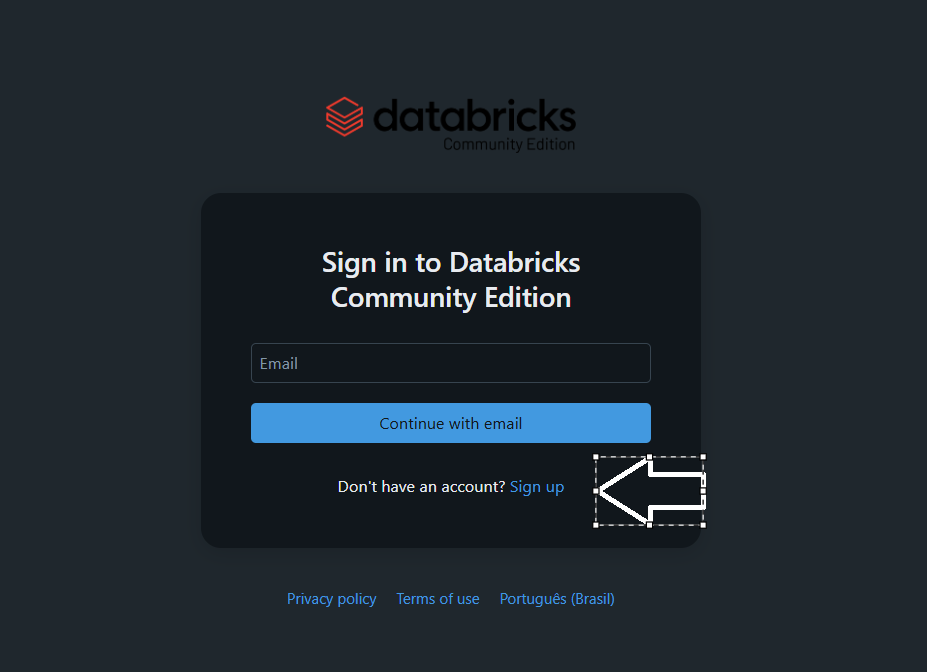
   - Siga o passo a passo indiccado no site

2. **Criar um Cluster:**
   - Após logar, no menu lateral esquerdo, clique em  "Compute"
   - 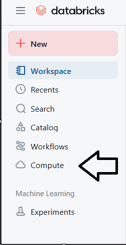
   - Após entrar na aba "Compute", no lado direto clice em "Create Compute".
   - 
   - Nomeie o cluster (por exemplo, `code-elevate-cluster`).
   - Deixe a configuração padrão e clique em "Create Compute".

3. **Importar os Arquivos:**
   - Acesse "Workspace" → "Users" → [Seu Usuário].
   - 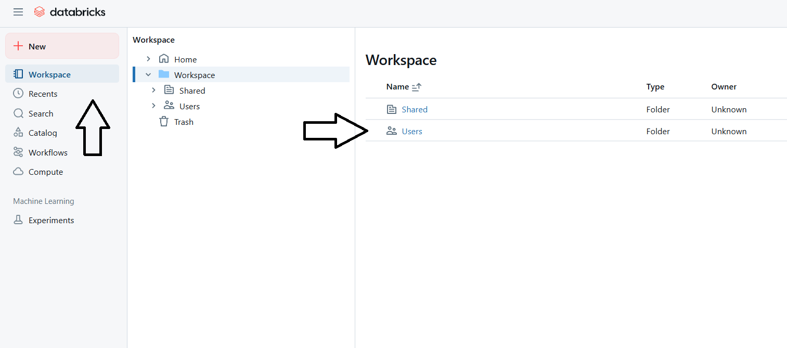
   - Clique com botão direito sobre alguma parte em branco da página → "Import".
   - Importe os arquivos:
     - `etl_pipeline.py`
     - `run.py`
   - 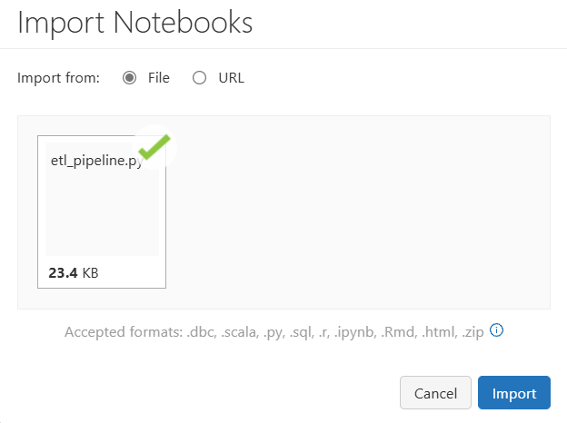
   - Talvez seja necessário importar um arquivo de cada vez!

4. **Upload do Arquivo de Log (opcional):**
   - No arquivo run.py, já há um exemplo e dados de configuração dos parâmetros para utilizar a extração via HTTP, mas se preferir por executar utilizando o Upload manual via databricks, só seguir os seguintes passos abaixo
   - No canto superior esquerdo do Databricks, clique em  "+ New" → "Add or Upload Data".
   - 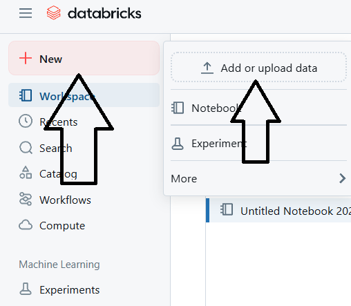
   - Faça upload do arquivo de log (caso não utilize a URL pública fornecida).
   - 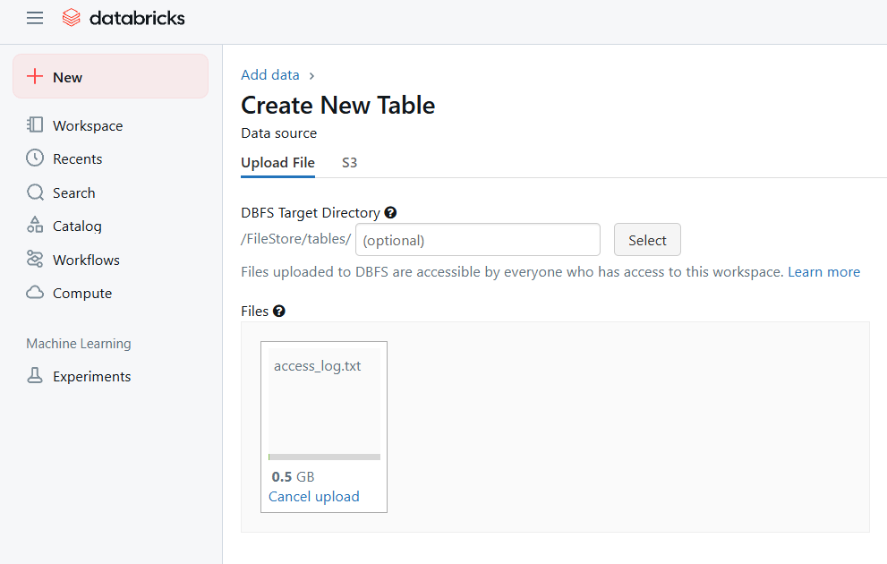

5. **Informações Adicionais:**
   - Link para URL com arquivo: "https://codeelevatestoragelog.blob.core.windows.net/logs/access_log.txt"
   - O tipo de arquivo, terminação do file_name, pode ser .csv ou .txt para dados extraídos via URL ou UPLOADED, mas deve obedecer o formato de origem em que ele está salvo.
   - O notebook 'run.py' já irá vir configurado para rodar, e com detalhes descritivos de cada etapa em comentários e células markdwown.
  

## Como Executar o Projeto

1. **Abra o Notebook run.py:**
   - Clique no notebook "run.py" pois é ele que será usado para executar o ETL.

2. **Importar o conteúdo do ETLPipeline:**

   - Rode a primeira célula, que contém o seguinte código:

```python
#Rode a  que contém esse conteúdo antes de todo o restante do código.
%run ./etl_pipeline
```

3. **Exemplos de como parametrizar as informações:**
 - Para parametrizar os dados do ETL temos duas formas de passar os parâmetros, escolha a de sua preferência:.
 - Dentro do notebook 'run.py', a primeira forma já está configurada para ser executada

```python
#Crie uma instância da Classe ETLPipeline, onde cada parâmetro passado é os dados do ETL que irá rodar
params = {
    "pipeline_name": "access_log",
    "source": "URL",
    "url": "https://codeelevatestoragelog.blob.core.windows.net/logs/access_log.txt",
    "table_name_bronze": "b_access_logs",
    "table_name_silver": "s_access_logs",
    "table_name_gold": "g_access_logs",
    "file_name": "access_log.txt",
    "is_log": True,
    "sql_silver": """ REGRA SQL AQUI  """,
    "sql_gold":  """ REGRA SQL AQUI  """
}

etl = ETLPipeline(spark, **params)
```

```python
#Crie uma instância da Classe ETLPipeline, onde cada parâmetro passado é os dados do ETL que irá rodar
etl = ETLPipeline(spark, 
    pipeline_name = 'nome_do_pipeline' 
    source= 'URL',  
    url='https://codeelevatestoragelog.blob.core.windows.net/logs/access_log.txt',  
    table_name_bronze = "b_access_logs",
    table_name_silver = "s_access_logs",
    table_name_gold = "g_access_logs",
    file_name = "access_log.txt",
    is_log = True,
    sql_silver = """  REGRA SQL AQUI  """,
    sql_gold = """ REGRA SQL AQUI  """
)
```

4. **Descrição dos parâmetros para ETLPipeline**
   
| Parâmetro             | Obrigatório | Tipo    | Descrição                                                                                                                                                                                                                       |
|-----------------------|-------------|---------|-----------------------------------------------------------------------------------------------------------------------------------------------------------------------------------------------------------------------------------|
| `pipeline_name`       | Sim         | String  | Nome do pipeline. Não deve conter espaços ou caracteres especiais.                                                                                                                                                              |
| `url`                 | Não*        | String  | URL para acesso ao arquivo. Obrigatório somente se o `source` for `URL`. Não é necessário se `source` for `UPLOADED`.                                                                                                     |
| `table_name_bronze`   | Sim         | String  | Nome da tabela a ser criada na camada Bronze.                                                                                                                                                                                    |
| `table_name_silver`   | Sim         | String  | Nome da tabela a ser criada na camada Silver.                                                                                                                                                                                    |
| `table_name_gold`     | Sim         | String  | Nome da tabela a ser criada na camada Gold.                                                                                                                                                                                      |
| `file_name`           | Sim         | String  | Nome do arquivo a ser processado. Para `UPLOADED`, deve ser exatamente o nome do arquivo com sua terminação(Aceitos os tipos `.csv` ou `.txt`). Para `URL` pode ser o nome do arquivo que desejar colocar, porém também deve incluir extensão `.csv` ou `.txt` de acordo com tipo do arquivo.           |
| `source`              | Sim         | String  | Origem dos dados. <br>• `URL`: copia arquivo de uma URL pública. <br>• `UPLOADED`: lê arquivo enviado manualmente via FileStore do Databricks Community.                 |
| `is_log`              | Sim         | Boolean | Indica se o arquivo segue o formato padrão Apache Web Server Log (WSL). <br>• `True`: é um log Apache. <br>• `False`: outro tipo de dado.                                                                                        |
| `sql_silver`          | Sim         | String  | Consulta SQL contendo as regras de transformação para geração da tabela Silver.                                                                                                                                                 |
| `sql_gold`            | Sim         | String  | Consulta SQL contendo as regras de transformação para geração da tabela Gold.                                                                                                                                                   |


5. **Execução do Pipeline ETL** 

Após instanciar a classe `ETLPipeline`, você pode executar o pipeline completo ou controlar o fluxo de execução por etapas usando o método `execute_etl(step)`.

Exemplo de execução Completa

```python
etl.execute_etl(4)
```

- 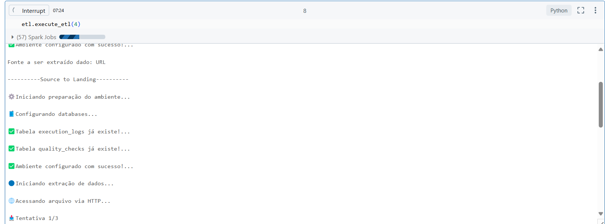

#### Significado do Parâmetro `step`

| `step` | Etapas Executadas                                                                 |
|--------|------------------------------------------------------------------------------------|
| 1      | `source_to_landing()`                                                             |
| 2      | `source_to_landing()` → `landing_to_bronze()`                                     |
| 3      | `source_to_landing()` → `landing_to_bronze()` → `bronze_to_silver()` |
| 4      | `source_to_landing()` → `landing_to_bronze()` → `bronze_to_silver()` → `silver_to_gold()` |

---

#### Execução de Etapas Individualmente

Você também pode executar cada etapa do pipeline de forma isolada.

####  1. Extração da Fonte para a Landing
```python
etl.source_to_landing()
```

####  2. Landing → Bronze
```python
etl.landing_to_bronze()
```

####  3. Bronze → Silver

```python
etl.bronze_to_silver()
```
####  4. Silver → Gold
```python
etl.silver_to_gold()
```

---

## Análise Visual dos Dados (Logs)

Após a execução completa do pipeline com o comando:

```python
etl.execute_etl(4)
```

Execute o comando abaixo para iniciar a análise visual automatizada dos dados:

```python
etl.log_analysis()
```

### O que esta função faz?

- Gera visualizações gráficas para as respostas exigidas no desafio.
- Apresenta uma tabela com as respostas formatadas das análises solicitadas.
- Utiliza internamente bibliotecas como **Plotly** para apresentar os gráficos de forma rica e interativa.

📌 **Importante:** Atualmente a função foi construída para **analisar exclusivamente logs Apache padrão** (`is_log=True`), mas poderá futuramente ser **expandida para aceitar tipos diferentes de análise**, passando um parâmetro de tipo desejado (ex: json, csv, etc) e as regras correspondentes de análise.

### Exemplo de saída visual gerada:

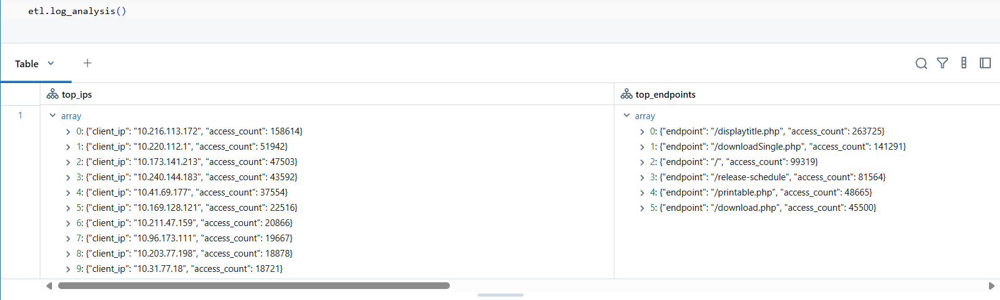  
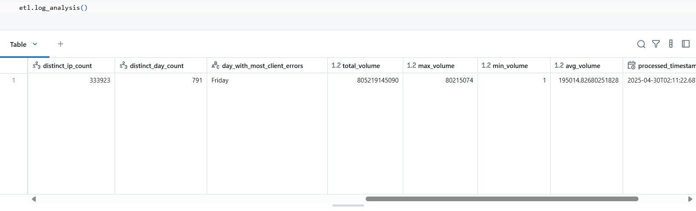  
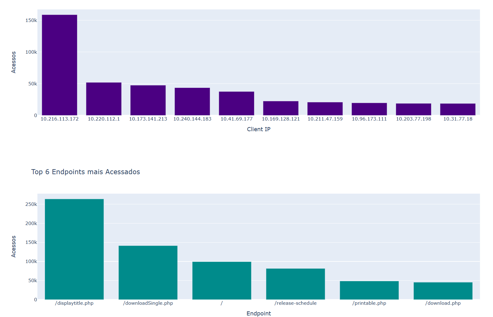

---

## Análise de Monitoramento de Execuções

Além da análise de logs, este projeto inclui uma função dedicada à **análise dos dados de execução do pipeline**, permitindo visualizar e monitorar seu histórico de execuções:

```python
etl.monitoring_analysis()
```

### O que essa função faz?

- Lê a tabela `monitoring.execution_logs`.
- Gera dashboards com indicadores e gráficos sobre a duração e sucesso das execuções.
- Ajuda a acompanhar a performance e qualidade da execução do pipeline ao longo do tempo.

### Exemplo de saída:

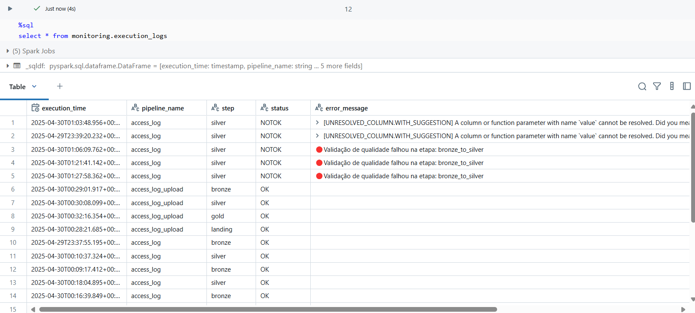  
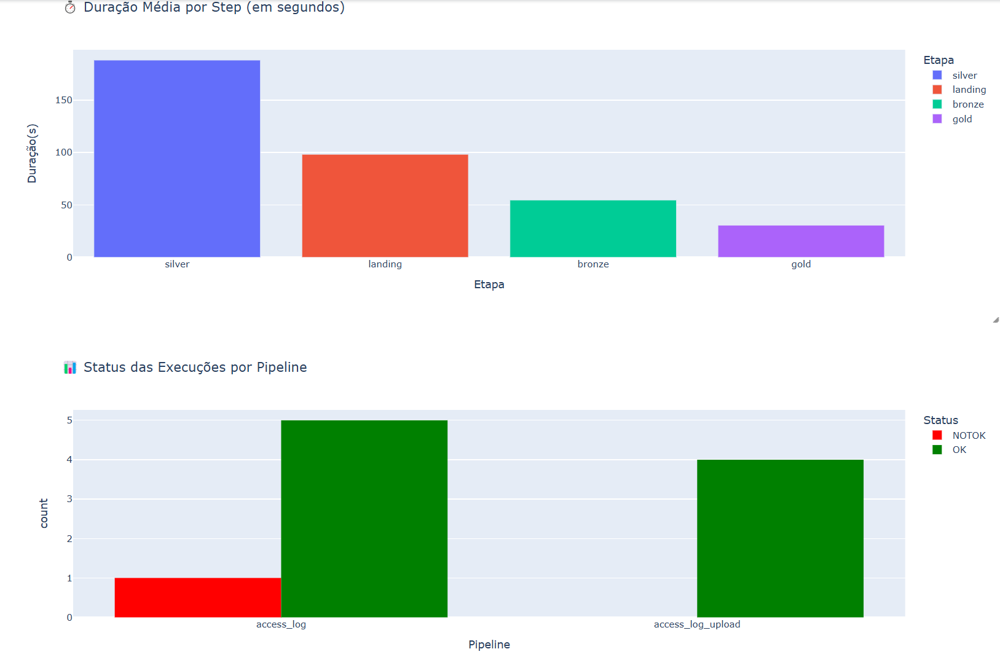

---

## Validações de Qualidade dos Dados (Data Quality)

O pipeline já conta com uma **etapa automatizada de verificação de qualidade** dos dados antes de salvar a **tabela Silver**, garantindo que:

- Nenhum dado com campos obrigatórios nulos (como IP, endpoint, timestamp) seja salvo.
- A quantidade total de registros seja válida (maior que zero).
- Cada verificação gera registros de log em uma tabela `quality.data_quality_logs`, permitindo **rastreabilidade e auditoria das verificações realizadas**.

📌 **Importante:** Atualmente a função foi construída para **analisar exclusivamente logs Apache padrão** (`is_log=True`), mas poderá futuramente ser **expandida para aceitar tipos diferentes de análise**, passando um parâmetro de tipo desejado (ex: json, csv, etc) e as regras correspondentes de análise.


### 🖼️ Visualização do resultado:

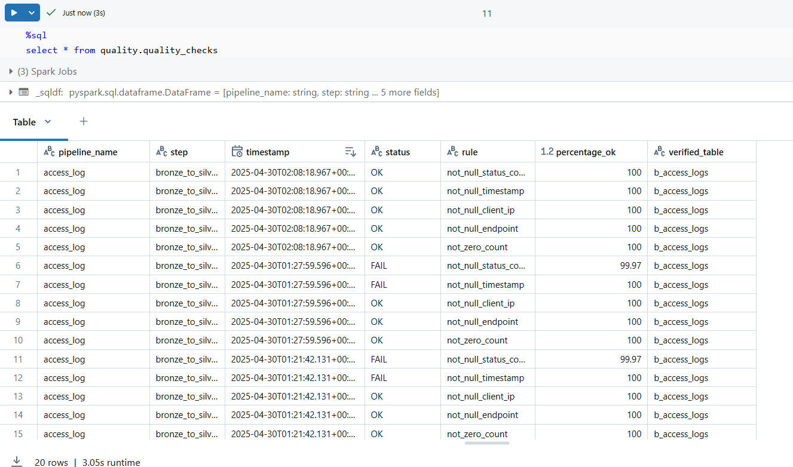

---

