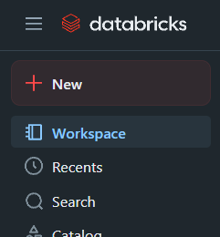
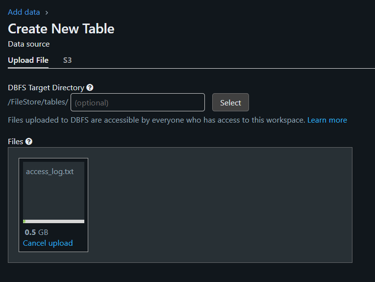

# ♨️ Web Server Log Analysis - Code Elevate Santander

## Descrição

Este projeto simula um fluxo de ETL para tratar dados de logs de servidores web, estruturando-os em camadas para posterior geração de métricas analíticas.

As ferramentas escolhidas para executar a tarefa foram o **Databricks Community Edition** em conjunto com o **Delta Lake** para armazenamento dos dados, pelos seguintes motivos:

- **Databricks** é uma plataforma focada em análise de dados de **Big Data**, com processamento distribuído em clusters e **Spark nativo**, o que atende diretamente aos requisitos da tarefa, sendo também uma das melhores opções para esse tipo de processamento.
- Em comparação com o uso do **Docker**, o Databricks requer muito menos esforço de configuração, pois oferece clusters de fácil criação sem a necessidade de instalação manual do Spark ou de gerenciamento de dependências.
- O **Delta Lake** é suportado nativamente pelo Databricks, o que proporciona vantagens como transações ACID, versionamento de dados e maior eficiência nas consultas. Isso torna a combinação **Databricks + Delta Lake** mais adequada do que utilizar bancos de dados relacionais ou NoSQL para este cenário.

Como o ambiente utilizado é o **Databricks Community Edition** (versão gratuita, não voltada para produção), algumas adaptações no código foram necessárias para simular um ambiente produtivo.  
Entre as adaptações, destacam-se:

- Utilização do **FileStore** nativo do Databricks para armazenamento dos dados, em vez de um Data Lake externo como S3 ou Azure Data Lake.
- Criação de um **Storage Account** na **Azure**, contendo um **Blob Storage** onde o arquivo de log foi disponibilizado publicamente, permitindo que o pipeline consuma o log diretamente via URL, além da opção de realizar upload manual para o Databricks.

Essas escolhas visaram garantir praticidade, atender todos os requisitos do desafio e manter boas práticas de engenharia de dados mesmo em ambiente de simulação.

---

## Flexibilidade e Generalização do Projeto

O projeto, apesar de ser direcionado para solucionar o desafio proposto, vai além, pois permite que o código de ETL extraia e trate outros tipos de dados além do log fornecido, uma vez que foi desenvolvido de forma totalmente **parametrizável**.

A estrutura do código foi construída seguindo princípios de:

- **Orientação a Objetos**;
- **Modularidade**;
- **Reutilização de Código**;
- **Separação de Responsabilidades**.

Isso facilita:

- Adaptar para diferentes fontes de dados (não apenas o log fornecido);
- Parametrizar o nome da execução, o nome das tabelas geradas e a origem dos dados;
- Realizar extrações tanto de arquivos via HTTP quanto de APIs públicas.

Como mencionado anteriormente, por se tratar de um projeto público e desenvolvido em ambiente limitado (**Databricks Community Edition**), foi mantida a simplicidade no acesso às APIs públicas, focando apenas em **requisições do tipo GET sem autenticação**.  
Também foi considerado o uso de arquivos via upload para o **FileStore** do Databricks, simulando uma estrutura de Data Lake simplificada.

---

## Benefícios do Projeto

- **Facilidade de manutenção**: alterações em uma parte do pipeline não impactam o todo;
- **Escalabilidade**: novos tipos de dados ou novas fontes podem ser adicionados com poucas modificações;
- **Padronização**: todos os fluxos seguem a mesma estrutura de camadas (Landing → Bronze → Silver → Gold);
- **Reaproveitamento**: funções e classes podem ser reutilizadas em outros projetos de Data Engineering;
- **Facilidade de testes**: modularidade permite testar componentes de forma isolada;
- **Organização**: separação clara entre responsabilidades de extração, transformação e carga.

---

Assim, mesmo com limitações impostas pelo ambiente, o projeto apresenta uma arquitetura sólida e boas práticas de Engenharia de Dados aplicadas a um cenário realista.

---

## Arquitetura da Solução

A arquitetura implementada segue o conceito de camadas de dados da Arquitetura Medalhão:

- **Landing**: Dados brutos recebidos no formato de origem.
- **Bronze**: Ingestão dos dados crus em formato estruturado.
- **Silver**: Transformação dos dados para formato tabular estruturado, efetuando limpezas, conversões, etc.
- **Gold**: Agregações e análises avançadas, gerando tabelas de métricas e insights.

Além disso, as tabelas foram organizadas para permitir consultas analíticas eficientes.

---

## Tecnologias Utilizadas

- **Apache Spark 3.3+**
- **Python 3.9+**
- **Databricks Community Edition**
- **Delta Lake**
- **SQL(Spark SQL)**

---

## Estrutura de Pastas

```plaintext
/
├── etl_pipeline.py           #Funções principais do pipeline ETL
├── Run.py                    #Script de execução parametrizada
├── README.md                  #Documentação do projeto
```

## Instalação e Configuração do Ambiente

1. **Criar Conta no Databricks:**
   - Acesse [Databricks Community Edition](https://community.cloud.databricks.com) e crie uma conta gratuita.

2. **Criar um Cluster:**
   - Após logar, clique em "Clusters" → "Create Cluster".
   - Nomeie o cluster (por exemplo, `code-elevate-cluster`).
   - Deixe a configuração padrão e clique em "Create Cluster".

3. **Importar os Arquivos:**
   - Acesse "Workspace" → "Users" → [Seu Usuário].
   - Clique com botão direito → "Import".
   - Importe os arquivos:
     - `etl_pipeline.py`
     - `Run.py`

4. **Upload do Arquivo de Log (opcional):**
   - Clique "Data" → "Add or Upload Data".
   - Faça upload do arquivo de log (caso não utilize a URL pública fornecida).
   - 
   - 

5. **Abra o Notebook Run.py:**
   - Clique no notebook "Run.py" pois é ele que será usado para executar o ETL.
   

## Como Executar o Projeto

1. **Importar o Código do Pipeline:**

```python
#Rode a celular que contém esse conteúdo antes de todo o restante do código.
%run ./etl_pipeline
```


2. **Exemplo 1 de como parametrizar as informações:**

```python
#Crie uma instância da Classe ETLPipeline, onde cada parâmetro passado é os dados do ETL que irá rodar
etl = ETLPipeline(spark, 
    pipeline_name = 'nome_do_pipeline' 
    source= 'URL',  
    url='https://codeelevatestoragelog.blob.core.windows.net/logs/access_log.txt',  
    table_name_bronze = "b_access_logs",
    table_name_silver = "s_access_logs",
    table_name_gold = "g_access_logs",
    file_name = "access_log.txt",
    is_log = True,
    sql_silver = """  REGRA SQL AQUI  """,
    sql_gold = """ REGRA SQL AQUI  """
)
```

3. **Exemplo 2 de como parametrizar as informações:**

```python
params = {
    "pipeline_name": "access_log",
    "source": "URL",
    "url": "https://codeelevatestoragelog.blob.core.windows.net/logs/access_log.txt",
    "table_name_bronze": "b_access_logs",
    "table_name_silver": "s_access_logs",
    "table_name_gold": "g_access_logs",
    "file_name": "access_log.txt",
    "is_log": True,
    "sql_silver": """ REGRA SQL AQUI  """,
    "sql_gold":  """ REGRA SQL AQUI  """
}

etl = ETLPipeline(spark, **params)
```

4. **Descrição dos parâmetros para ETLPipeline**
   
| Parâmetro             | Obrigatório | Tipo    | Descrição                                                                                                                                                                                                                       |
|-----------------------|-------------|---------|-----------------------------------------------------------------------------------------------------------------------------------------------------------------------------------------------------------------------------------|
| `pipeline_name`       | Sim         | String  | Nome do pipeline. Não deve conter espaços ou caracteres especiais.                                                                                                                                                              |
| `url`                 | Não*        | String  | URL da API ou do arquivo. Obrigatório somente se o `source` for `API` ou `URL`. Não é necessário se `source` for `UPLOADED`.                                                                                                     |
| `table_name_bronze`   | Sim         | String  | Nome da tabela a ser criada na camada Bronze.                                                                                                                                                                                    |
| `table_name_silver`   | Sim         | String  | Nome da tabela a ser criada na camada Silver.                                                                                                                                                                                    |
| `table_name_gold`     | Sim         | String  | Nome da tabela a ser criada na camada Gold.                                                                                                                                                                                      |
| `file_name`           | Sim         | String  | Nome do arquivo a ser processado. Para `UPLOADED`, deve ser exatamente o nome do arquivo. Para `URL`, deve incluir extensão `.csv` ou `.txt`. Para `API`, será o nome da pasta onde o Delta será salvo (sem extensão).           |
| `source`              | Sim         | String  | Origem dos dados. <br>• `API`: faz uma requisição GET a uma API pública. <br>• `URL`: copia arquivo de uma URL pública. <br>• `UPLOADED`: lê arquivo enviado manualmente via FileStore do Databricks Community.                 |
| `is_log`              | Sim         | Boolean | Indica se o arquivo segue o formato padrão Apache Web Server Log (WSL). <br>• `True`: é um log Apache. <br>• `False`: outro tipo de dado.                                                                                        |
| `sql_silver`          | Sim         | String  | Consulta SQL contendo as regras de transformação para geração da tabela Silver.                                                                                                                                                 |
| `sql_gold`            | Sim         | String  | Consulta SQL contendo as regras de transformação para geração da tabela Gold.                                                                                                                                                   |


5. **Execução do Pipeline ETL** 

Após instanciar a classe `ETLPipeline`, você pode executar o pipeline completo ou controlar o fluxo de execução por etapas usando o método `execute_etl(step)`.

Exemplo de execução Completa

```python
etl.execute_etl(4)
```


#### Significado do Parâmetro `step`

| `step` | Etapas Executadas                                                                 |
|--------|------------------------------------------------------------------------------------|
| 1      | `source_to_landing()`                                                             |
| 2      | `source_to_landing()` → `landing_to_bronze()`                                     |
| 3      | `source_to_landing()` → `landing_to_bronze()` → `bronze_to_silver()` |
| 4      | `source_to_landing()` → `landing_to_bronze()` → `bronze_to_silver()` → `silver_to_gold()` |

---

#### Execução de Etapas Individualmente

Você também pode executar cada etapa do pipeline de forma isolada.

####  1. Extração da Fonte para a Landing
```python
etl.source_to_landing()
```

####  2. Landing → Bronze
```python
etl.landing_to_bronze()
```

####  3. Bronze → Silver

```python
etl.bronze_to_silver()
```
####  4. Silver → Gold
```python
etl.silver_to_gold()
```


